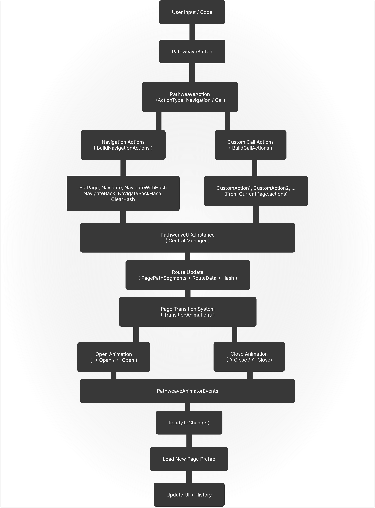
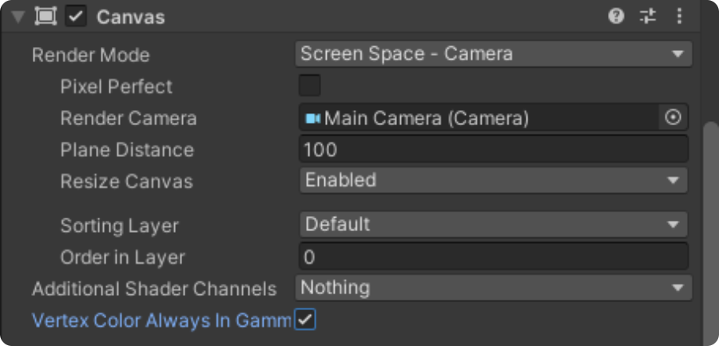
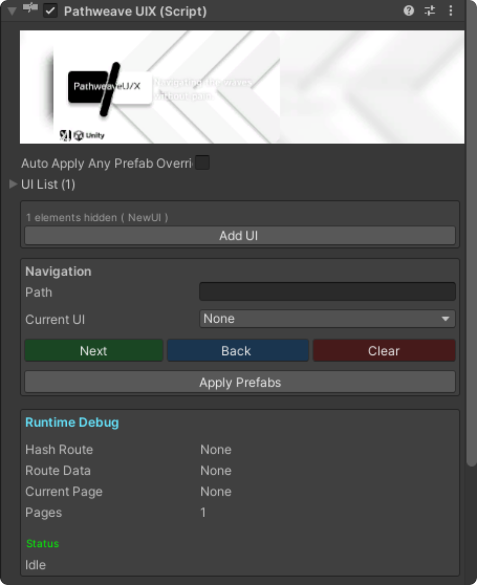
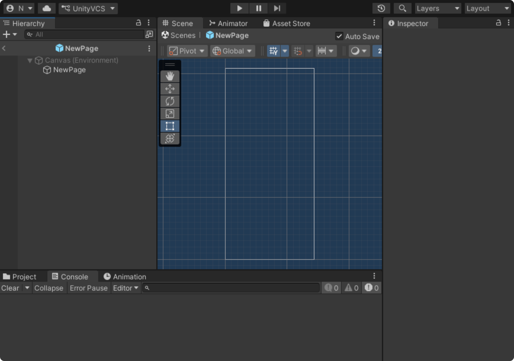
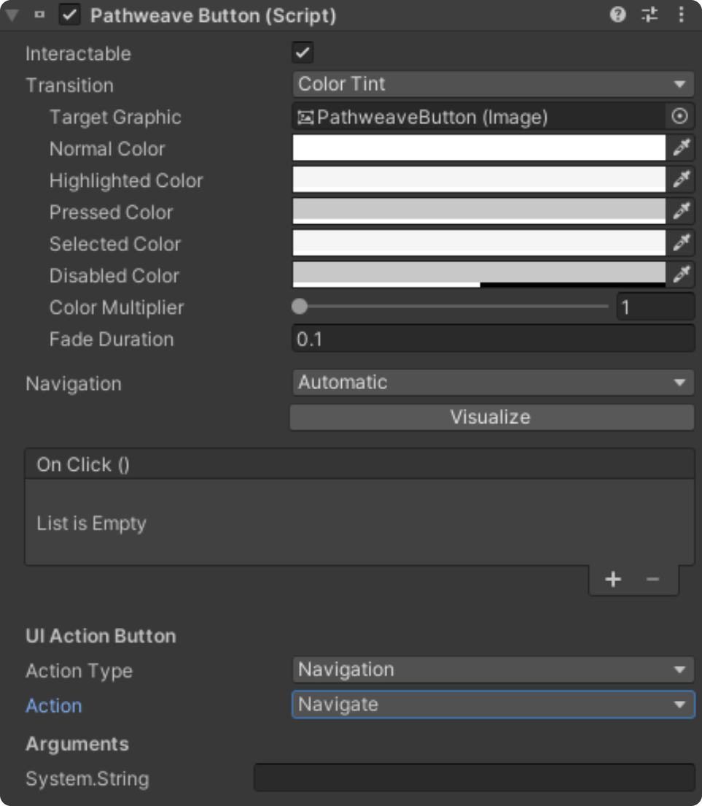
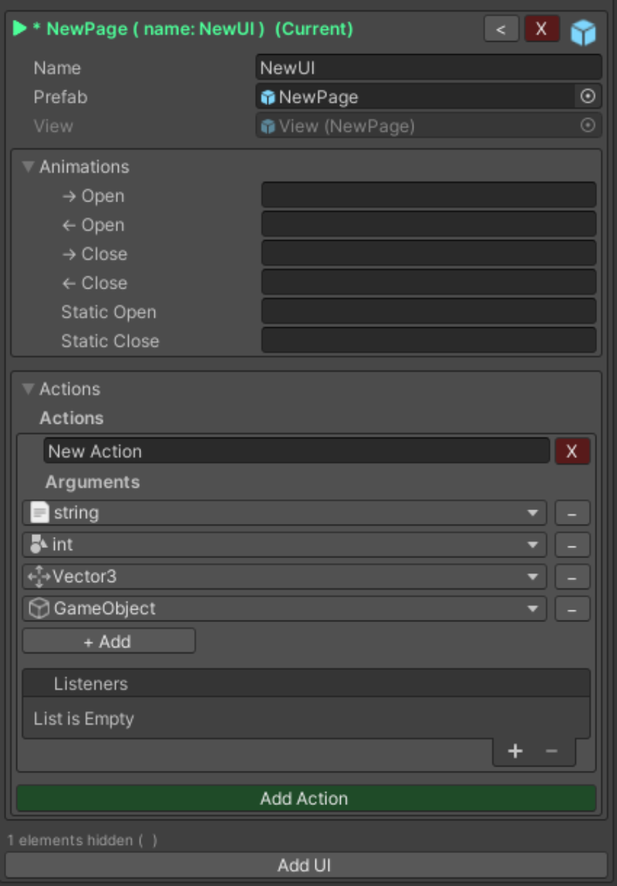
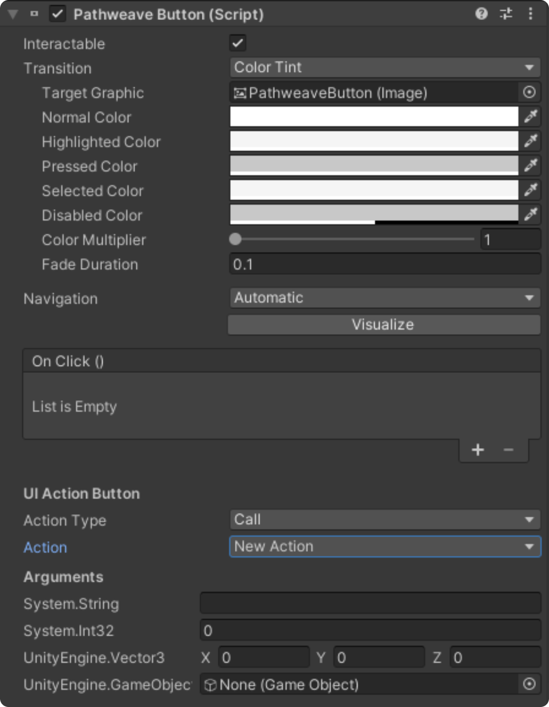
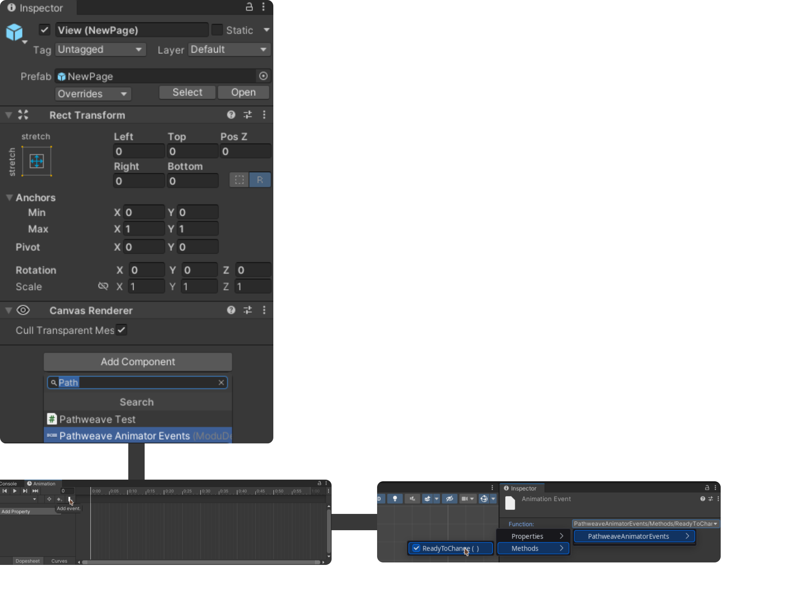
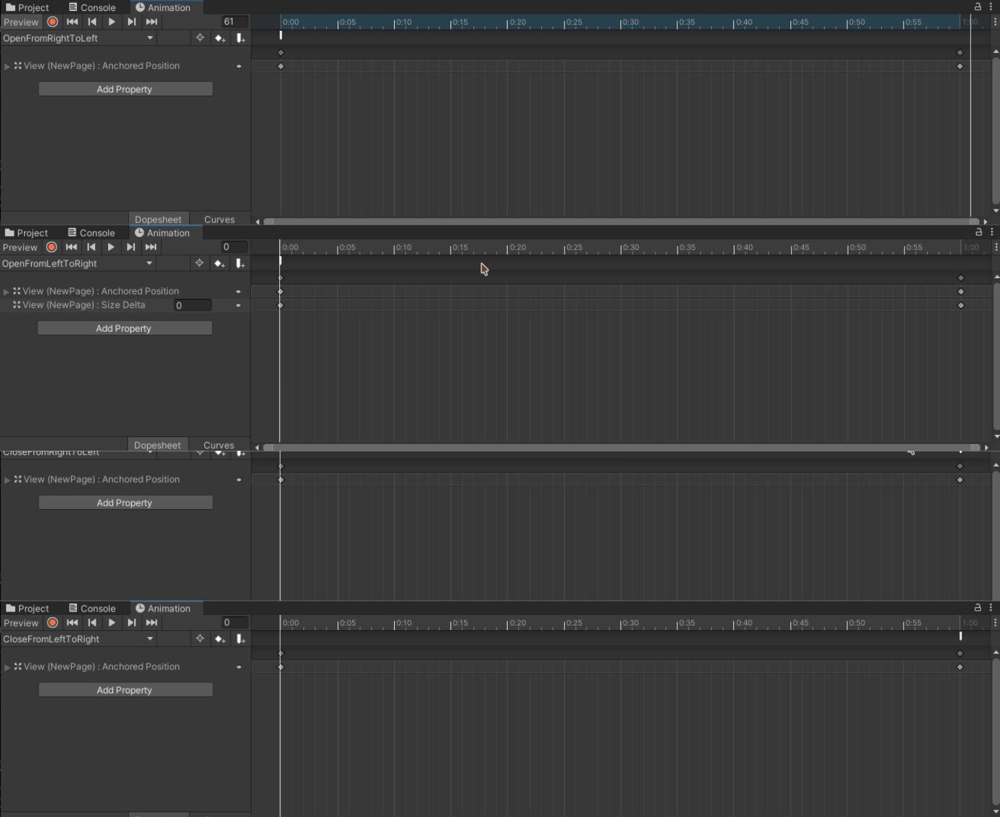

Practical step-by-step guide for working with the library.
This section collects the most important usage scenarios with code examples and illustrations.

Have fun reading! 🎉

---

## See also

* [Full reference documentation](./REFERENCE.md) — detailed description of all classes and methods
* [Technical documentation](./TECHNICAL.md) — internal architecture and extensibility
* [README](./README.md) — general project information

## Contents

* [1. Installation](#1-installation)
* [2. How to get started](#2-how-to-get-started)
  * [2.1 Set the Canvas parameters](#21-set-the-canvas-parameters)
  * [2.2 Add the PathweaveUIX component](#22-add-the-pathweaveuix-component)
* [3. Creating pages](#3-creating-pages)
  * [3.1 Create a folder](#31-create-a-folder)
  * [3.2 Creating a page prefab](#32-creating-a-page-prefab)
  * [3.3 Link the page to the PathweaveUIX manager](#33-link-the-page-to-the-pathweaveuix-manager)
* [4. Using PathweaveButton](#4-using-pathweavebutton)
  * [4.1 Creating a button](#41-creating-a-button)
  * [4.2 Navigation scenario](#42-navigation-scenario)
  * [4.3 Custom Action scenario](#43-custom-action-scenario)
* [5. Animation Transitions](#5-animation-transitions)
* [6. API for working from code](#6-api-for-working-from-code)

---



## 1. Installation

```bash
openupm add com.modudevcore.pathweaveuix
```

**Option B — Git URL (UPM)**
In Unity:
`Window → Package Manager → + → Add package from git URL`

```text
https://github.com/ModuDevCore/PathweaveUIX-Unity.git
```

**Option C — .unitypackage**
Download the latest release and import the `.unitypackage` into Unity.
flatpak install flathub com.icons8.Lunacy
---

## 2. How to get started

### 2.1 Set the Canvas parameters
Create a Canvas on the stage and make sure the properties in the inspector look like this ( You can edit them, but these are used for demos ):


### 2.2 Add the PathweaveUIX component
Transfer the [PathweaveUIX](./REFERENCE.md#ModuDevCore.PathweaveUIX.PathweaveUIX) component to the created Canvas, which will serve as the page switching manager.


---

## 3. Creating pages

### 3.1 Create a folder
Create a folder in any path in the Assets folder.
```/Assets/*/Pages```


### 3.2 Creating a page prefab
Go to the folder with the pages and right-click on the folder space to open the context menu.
Then choose in context menu: `Create -> Pathweave -> New Page`

The content of the page should be as follows:


### 3.3 Link the page to the PathweaveUIX manager
1) Open the component that was previously bound to the Canvas component [PathweaveUIX](./REFERENCE.md#ModuDevCore.PathweaveUIX.PathweaveUIX)


2) Click Add UI ( If the elements are hidden, click on the text "N elements hidden ( ... )" )

3) After creating the UI instance ( [PathweavePage](./REFERENCE.md#ModuDevCore.PathweaveUIX.Data.PathweavePage) ), specify a reference name that will be used for routing, and bind the created page to the Prefab property.
The navigation scenario using the button
---

## 4. Using [PathweaveButton](./REFERENCE.md#ModuDevCore.PathweaveUIX.Runtime.UI.PathweaveButton)

### 4.1 Creating a button
1) Open the page prefab by selecting it on the scene through the PathweaveUIX manager or in the files. (The page you created in step 3)


2) Right-click on an object inside the page and select the following: ```UI -> Pathweave -> Button```

### 4.2.1 The navigation scenario using the button
1) Select [Action Type](./REFERENCE.md#ModuDevCore.PathweaveUIX.Runtime.Actions.PathweaveAction.ActionType) -> ```Navigation``` 

2) After that, select one of the ```Action``` options from the list

<details>
<summary>Action ( Navigate actions )</summary>

#### SetPage
Erases the entire page route and sets one.

#### Navigate
Sets the next page using the example ```./NextPage```

#### NavigateWithHash
It works similarly to Navigate, but leaves hash data as follows: ```./#hashdata``` -> ```./NewPage#hashdata```

#### NavigateBack
Returns to the previous page using the example ```./CurrentPage/..```

#### NavigateBackHash
It works similarly to NavigateBack, but leaves hash data as follows: ```./CurrentPage/..#hashdata``` -> ```./#hashdata```

#### ClearHash
Clears hashdata from the route.
</details>

-> In our case, we choose Navigate.

3) In Arguments, where ```System.String```, set the path to which you want to navigate when you click the button (the path can look like "/NewPage1/NewPage2/..." or "NewPage1/NewPage2/..." or "NewPage1" )

4) Now we start the game and check the button press.



### 4.2.1 Custom Action script with a call to the Pathweave manager
1) Open the UI instance from the PathweaveUIX page where you want to create a custom Action. (The page you created in step 3)


2) Open the Actions tab and click the "Add Action" button. In the new Action, set the Action name.

3) In the new Action, click on Arguments and click on the "+ Add" button. Set the argument type to either the standard type in the Types tab or the component in the Components section.

4) Now, according to UnityEvent, add events to the Listeners list.

5) Open PathweaveButton ( You need to open it on the stage inside the PathweaveUIX manager ) and select [Action Type](./REFERENCE.md#ModuDevCore.PathweaveUIX.Runtime.Actions.PathweaveAction.ActionType) -> ```Call```

6) Now, when you click on the Action, your custom Action should appear in the list. By selecting it, you can initialize the arguments that you previously configured when creating the custom Action.


## 5. Animation Transitions ( [PathweaveAnimatorEvents](./REFERENCE.md#ModuDevCore.PathweaveUIX.Runtime.Animation.PathweaveAnimatorEvents) )
This section provides instructions on how to create a page transition animation.

### 5.1 Beginning
1) Open the UI instance in PathweaveUIX that your page is linked to.


2) Expand the Animations section ( [TransitionAnimations](./REFERENCE.md##ModuDevCore.PathweaveUIX.Data.PathweavePage.TransitionAnimations) ) by clicking on it, and you will see several items with brief descriptions:
All of them are text properties containing a statename reference for [Animator.Play](https://docs.unity3d.com/ru/current/ScriptReference/Animator.Play.html)
 - ```-> Open``` - ```./Page``` -> ```./Page/PageWhereAnimationWillBeStarted``` - PageWhereAnimationWillBeStarted starts the animation of opening from left to right.
 - ```<- Open``` - ```./PageWhereAnimationWillBeStarted/Page/..``` -> ```./PageWhereAnimationWillBeStarted``` - PageWhereAnimationWillBeStarted starts the animation of opening from right to left.
 - ```-> Close``` - ```./PageWhereAnimationWillBeStarted``` ->```./PageWhereAnimationWillBeStarted/NewPage``` - PageWhereAnimationWillBeStarted starts the animation of closing from left to right.
 - ```<- Close``` - ```./Page/PageWhereAnimationWillBeStarted``` ->```./Page``` - PageWhereAnimationWillBeStarted starts the closing animation from right to left.
 - ```Static Open``` - A static opening animation that is triggered if the animation is not found or does not match any other animation.
 - ```Static Close``` - A static closing animation that is triggered if the animation is not found or does not match any other animation.

3) Create an animation for each scenario and add the [PathweaveAnimatorEvents](./REFERENCE.md#ModuDevCore.PathweaveUIX.Runtime.Animation.PathweaveAnimatorEvents) component to the pages that use animations (This component will be used for events that indicate the end and start of page opening and closing animations)



P.S. In simple terms, the ReadyToChange() event should be placed where the closing animation ends and at the beginning of the opening animation.

4) Now you can launch the game and check the animations. ( Animations don't work in the editor )


---

## 6. API for working from code.
### Short content
- [PathweaveUIX.Instance](./REFERENCE.md#ModuDevCore.PathweaveUIX.PathweaveUIX.Instance)
- [PathweaveEvent](./REFERENCE.md#ModuDevCore.PathweaveUIX.Runtime.Events.PathweaveEvent)
- [PathweaveAction](./REFERENCE.md#ModuDevCore.PathweaveUIX.Runtime.Actions.PathweaveAction)

### 6.1 PathweaveUIX Instance
PathweaveUIX is a page management manager, and you can access its API through [PathweaveUIX.Instance](./REFERENCE.md#ModuDevCore.PathweaveUIX.PathweaveUIX.Instance), but make sure that PathweaveUIX is the only one on the stage to avoid conflicts.

```csharp
using UnityEngine;
using ModuDevCore.PathweaveUIX;

public class PathweaveExample : MonoBehaviour
{
    [ContextMenu("Set RouteData")]
    public void SetRouteData() {
        PathweaveUIX.Instance.RouteData = "Hello World!";
    }
    [ContextMenu("Print RouteData")]
    public void TestPrintRouteData() {
        Debug.Log(PathweaveUIX.Instance.RouteData);
    }
    [ContextMenu("Print Paths")]
    public void TestPrintPaths() {
        Debug.Log(PathweaveUIX.Instance.PagePath); // Without root hash.
        Debug.Log(PathweaveUIX.Instance.FullPagePath); // With root hash.
        Debug.Log(PathweaveUIX.Instance.FullPagePath); // Including route data hash.
        Debug.Log(PathweaveUIX.Instance.PagePathSegments); // Path segments.
        Debug.Log(PathweaveUIX.Instance.CurrentPage); // Current CurrentPage.
        // Check Reference For More
    }
    [ContextMenu("Test Navigate page1 -> page2")]
    public void TestNavigate() {
        PathweaveUIX.Instance.Navigate("page1/page2");
    }
    [ContextMenu("Test Navigate With Hash page1 -> page2")]
    public void TestNavigateWithHash() {
        PathweaveUIX.Instance.NavigateWithHash("page1/page2");
    }
    [ContextMenu("Test NavigateBack")]
    public void TestNavigateBack() {
        PathweaveUIX.Instance.NavigateBack();
    }
    [ContextMenu("Test NavigateBackWithHash")]
    public void TestNavigateBackWithHash() {
        PathweaveUIX.Instance.NavigateBackWithHash();
    }
    [ContextMenu("Test SetPage")]
    public void SetPage() {
        PathweaveUIX.Instance.SetPage("page1");
    }    
    [ContextMenu("Test Set Last To page1")]
    public void SetLast() {
        var segments = PathweaveUIX.Instance.PagePathSegments;
        segments[segments.Count - 1] = "page1";
        PathweaveUIX.Instance.PagePathSegments = segments;
    }
    [ContextMenu("Test ClearHash")]
    public void TestClearHash() {
        PathweaveUIX.Instance.ClearHash();
    }
}
```

### 6.2 [PathweaveEvent](./REFERENCE.md#ModuDevCore.PathweaveUIX.Runtime.Events.PathweaveEvent) Property
[PathweaveEvent](./REFERENCE.md#ModuDevCore.PathweaveUIX.Runtime.Events.PathweaveEvent) - emulates UnityEvent structure, but can set its own number of arguments by serializing them. It is used in [PathweaveUIX](./REFERENCE.md#ModuDevCore.PathweaveUIX.PathweaveUIX) to work with [PathweaveAction](./REFERENCE.md#ModuDevCore.PathweaveUIX.Runtime.Actions.PathweaveAction).

```csharp
using System.Collections.Generic;
using UnityEngine;
using ModuDevCore.PathweaveUIX.Runtime.Events;
using ModuDevCore.PathweaveUIX.Data;

public class PathweaveExample : MonoBehaviour
{
    public PathweaveEvent pathweaveEvent;

    [ContextMenu("Test AddListener ( Current Component )")]
    public void AddListener() {
        pathweaveEvent.AddListener(this, "TestMethod");
    }
    [ContextMenu("Test RemoveFirstListener")]
    public void RemoveListener() {
        pathweaveEvent.RemoveListener(0);
    }
    [ContextMenu("Set Arguments ( string )")]
    public void SetArguments() {
        pathweaveEvent._argumentTypes = new List<ArgumentType>() {
            new ArgumentType() {
                typeName = typeof(string).FullName
            }
        };
    }
    [ContextMenu("Test Invoke ( string )")]
    public void Invoke() {
        pathweaveEvent.Invoke("Hello wordl!");
    }

    public void TestMethod(string test) {
        Debug.Log(test);
    }
}
```

### 6.3 [PathweaveAction](./REFERENCE.md#ModuDevCore.PathweaveUIX.Runtime.Actions.PathweaveAction) Property
The [PathweaveAction](./REFERENCE.md#ModuDevCore.PathweaveUIX.Runtime.Actions.PathweaveAction) property works the same way as in [PathweaveButton](./REFERENCE.md#ModuDevCore.PathweaveUIX.Runtime.UI.PathweaveButton) and can trigger an Action from the page to the PathweaveUIX manager.

```csharp
using System.Collections.Generic;
using UnityEngine;
using ModuDevCore.PathweaveUIX.Runtime.Actions;
using ModuDevCore.PathweaveUIX.Data;

public class PathweaveExample : MonoBehaviour
{
    public PathweaveAction pathweaveAction;

    [ContextMenu("Set Action Type/Navigation")]
    public void ActionTypeNavigation() {
        pathweaveAction.actionType = PathweaveAction.ActionType.Navigation;
    }
    [ContextMenu("Set Action Type/Call")]
    public void ActionTypeCall() {
        pathweaveAction.actionType = PathweaveAction.ActionType.Call;
    }
    [ContextMenu("SetNavigationAction/SetPage")]
    public void SetNavigationActionSetPage() {
        pathweaveAction.selectedAction = "SetPage";
    }
    [ContextMenu("SetNavigationAction/Navigate")]
    public void SetNavigationActionNavigate() {
        pathweaveAction.selectedAction = "Navigate";
    }
    [ContextMenu("SetNavigationAction/NavigateWithHash")]
    public void SetNavigationActionNavigateWithHash() {
        pathweaveAction.selectedAction = "NavigateWithHash";
    }
    [ContextMenu("SetNavigationAction/NavigateBack")]
    public void SetNavigationActionNavigateBack() {
        pathweaveAction.selectedAction = "NavigateBack";
    }
    [ContextMenu("SetNavigationAction/NavigateBackWithHash")]
    public void SetNavigationActionNavigateBackWithHash() {
        pathweaveAction.selectedAction = "NavigateBackWithHash";
    }
    [ContextMenu("SetNavigationAction/ClearHash")]
    public void SetNavigationActionClearHash() {
        pathweaveAction.selectedAction = "ClearHash";
    }
    [ContextMenu("SetCallAction/Test")]
    public void SetCallActionTest() {
        pathweaveAction.selectedAction = "Test"; // If it's not in the manager, nothing will happen.
    }
    [ContextMenu("SetArguments ( string Hello World! )")]
    public void SetArguments() {
        pathweaveAction.arguments = new List<SerializedArgumentValue>() {
            new SerializedArgumentValue() {
                argumentType = new ArgumentType() {
                    typeName = typeof(string).FullName
                },
                stringValue = "Hello World!"
            }
        };
    }  
    [ContextMenu("PrintArgumentsArray")]
    public void PrintArgumentsArray() {
        Debug.Log(pathweaveAction.GetArgumentsArray());
    }      
    [ContextMenu("Invoke")]
    public void Invoke() {
        pathweaveAction.InvokeSelected();
    }  
}
```